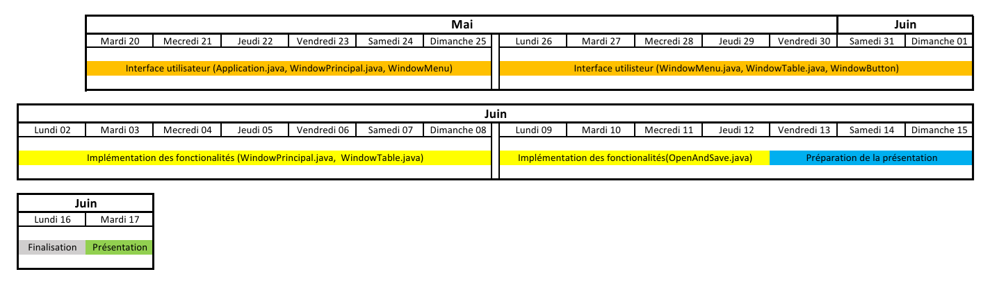
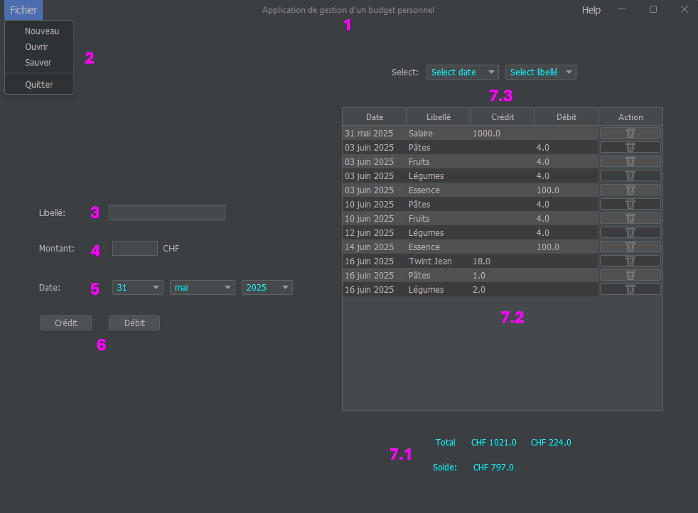

# AppBudget
[](https://opensource.org/licenses/MIT)
Application de gestion d'un budget personnel.

# Cahier des charges de l'application

L'application permet à l'utilisateur de créer et de gérer un petit budget individuel, par exemple, pour le ménage ou pour des vacances. 

Il y a un menu "Fichier", contenant 4 items; "Nouveau", "Ouvrir", "Enregistrer", "Quitter". Ceci permet de créer, de modifier plusieurs budgets. Le nom du budget est afficher dans le cadre de le fenêtre de l'application. 

Une partie "formulaire" contient les champs "Libellé", "Montant" et "Date". Le champs date est composé de 3 menus déroulants, pour le choix du jour, du mois et de l'année.

Une fois l'objet saisi, il faudra cliquer sur le bouton "Crédit" ou sur le bouton "Débit" pour enregistrer l'objet dans la table, située sur la partie droite de l'interface. Cette table affiche les objets saisis ainsi qu'un bouton de suppression qui peut agir sur chaque entrée au besoin.

Sur le haut de la table, se trouvent deux menus déroulants qui permettent de sélectionner une date ou un libellé et cette sélection filtre l'affichage dans la table. Les deux sélections se combienent, pour afiner les recherches.

Au bas de la table, nous affichons les totaux des crédits et des débits dynamiquement en fonction des sélections appliquées, ainsi que le solde qui lui reste global, indépendament de la sélection. 


## Planning



## Structure du projet
```mardown
└── AppBudget
    ├── .gitignore
    ├── schema.jpg
    ├── planning.png
    ├── README.md
    ├── assets
    │   └── trash.png
    │   └── trash_gray.png
    ├── data
    │   └── budget_120625.csv
    ├── Lib
    │   └── flatlaf-3.4.jar
    └── src
        ├── Account.java
        │   └──Account
        │      ├── Account constructor
        │      ├── getDate method
        │      ├── getLibelle method
        │      ├── getCredit method
        │      └── getDebit method
        ├── BudgetController.java
        │   └── BudgetController class
        │       ├── BudgetController constructor
        │       ├── addEntry method
        │       ├── clearTable method
        │       ├── applyFilters method
        │       ├── getFilteredDates method
        │       ├── getFilteredLibelles method
        │       ├── getDay method
        │       ├── setDay method
        │       ├── getMonth method
        │       ├── setMonth method
        │       ├── getYear method
        │       ├── setYear method
        │       ├── getRowCount method
        │       ├── getColumnCount method
        │       ├── getValueAt method
        │       ├── getDate method
        │       ├── getLibelle method
        │       ├── getMonth method
        │       ├── getSoldeCredit method
        │       ├── getSoldeDebit method
        │       └── getSolde method
        ├── BudgetModel.java
        │   └── BudgetModel class
        │       ├── BudgetModel constructor
        │       ├── getColumnName method
        │       ├── getValueAt method
        │       ├── isCellEditable method
        │       ├── getRowCount method
        │       ├── getColumnCount method
        │       ├── addEntry method
        │       ├── clearTable method
        │       ├── removeRow method
        │       ├── getFilteredDates method
        │       ├── getFilteredLibelles method
        │       ├── applyFilters method
        │       ├── sumCalculation method
        │       ├── getSoldeCredit method
        │       ├── getSoldeDebit method
        │       ├── getSolde method
        │       ├── setDay method
        │       ├── setMonth method
        │       ├── setYear method
        │       ├── getDay method
        │       ├── getMonth method
        │       ├── getYear method
        │       ├── getDate method
        │       ├── getLibelle method
        │       └── addPropertyChangeListener method
        ├── DatePicker.java
        │   └── DatePicker constructor
        ├── MainApp.java
        │   └── main method
        ├── NeSaOP.java
        │   ├── NewFile method
        │   ├── SaveFile method
        │   └── OpenFile method
        ├── WindowForms.java
        │   ├─── WindowForms class
        │   │   ├── WindowForms constructor
        │   │   └── checkInput method
        │   └── IntFilter class
        │       ├── insertString constructor
        │       ├── getFilteredDates method
        │       ├── check method
        │       └── replace method
        ├── WindowMain.java
        │   └─── WindowMain class
        │        ├── WindowMain constructor
        │        └── restartUI method
        ├── WindowMenu.java
        │   └─── WindowMenu class
        │        └── WindowMenu constructor
        ├── WindowMessages.java
        │   └─── WindowMessages class
        │        └── WindowMessages constructor
        └── WindowTable.java
            ├─── WindowTable class
            │    ├── WindowTable constructor
            │    ├── propertyChange method
            │    ├── refreshButtonRenderer method
            │    ├── checkCombobox method
            │    ├── onFilterChanged method
            │    ├── updateComboBoxes method
            │    ├── getDay method
            │    ├── getFilteredDates method
            │    ├── check method
            │    └── replace method
            └── ButtonEditor class
                ├── ButtonEditor constructor
                ├── getTableCellEditorComponent method
                └── getCellEditorValue method  


```


### Compilation de l'application
    
    javac -cp ".;../Lib/flatlaf-3.4.jar" MainApp.java
    java -cp ".;../Lib/flatlaf-3.4.jar" MainApp    

# Manuel d’utilisateur 

#### Schema de l'application



Nous avons en :
1) Le nom du budget 
2) Un menu pour créer , ouvrir, sauvegarder un budget et quitter l'appliaction
3) Le libellé de la transaction.
4) Le montant de la transaction.
5) La date de la transaction.
6) Le type de la transaction.
7) Tableau du budget personnel avec :\
    7.1 les totaux des actifs et passifs, ainsi que  le solde du compte\
    7.2 la table qui affiche les saisies et les sélections\
    7.3 les sélecteurs de filtres

## Mode d'emploi et réactions attendues

### Menu Fichier 
- Contient 4 onglets
    - Nouveau : Si on veut créer un nouveau projet
    - Ouvrir : Pour ouvrir un projet. Le fichier doit être un .csv. Les données spérarées par une virgule, qui doit contenir les champs suivant {xx mois yyyy, libellé,floatcrédit,floatdébit,null} (laisser null à la place de floatcrédit ou floatdébit en fonction du besoin) dans la cellule A1->A2->etc.
    - Enregistrer : Qui permet d'enregistrer les saisies, de créer le .csv et de l'enregistrer dans un dossier à choix de l'utilisateur
    -Quitter : Qui ferme l'application

### Formulaire de saisie
- Champ Libellé : Permet de saisir une courte description du motif du mouvement financier
- Champ Montant : ne doit contenir que des chiffres. Les entiers sont transformés en float.
- Champ Date : permet de sélectionner le jour, mois et année relatifs à la saisie

- Boutons Crédit et Débit : permet d'insérer les saisies dans la table, et d'attribuer le montant à la bonne colonne. A noter qu'un message d'erreur apparait si l'un des champs Libellé-Monant-Date n'est pas rempli. Le contenu des champs Libellés et Date est vidé après l'insersion dans la table.

### Table 
- Les saisies sont inscrites dans la table par ordre d'arrivée. 
- Changer l'ordre d'affichage des insertions n'est pas possible
- Les lignes sont verrouillées, la modification des insertions n'est pas possible
- Chaque ligne contient un bouton qui permet de supprimer la saisie, au besoin 

### Fonction de recherche par filtres

- A chaque insertion le script vérifie si le champs Date et Libellé contiennent déjà la même entrée. Si tel n'est pas le cas, la nouvelle date ou le nouveau libellé est ajouté respectivement dans le menu déroulant
- En sélection une ligne dans le menu déroulant, la table actualise son affichage pour ne montrer que le contenu filtré
- Les deux filtres peuvent être utilisés simultanénement et on un impact l'un sur l'autre
- L'affichage au bas de la page des totaux crédités et débités est dynamique et affiche le résultat des cellules affichées
- Le solde affiché est quand à lui le résultat du solde global, indépendament de la sélection affichée dans la table. 


## Amélioration de l'application
- Ajout d'un popup à l'ouverture du programme pour ouvrir ou créer un projet
- Ajouter dans le Menu Fichier un onglet "Enregistrer sous"
- Ajouter dans le Menu Help un onglet manuel d'utilisateur et donc d'ajouter un manuel à l'application
- Ajouter un type de dépense exemple (loisir, nourriture, fixe, etc.)
- Améliorer l'input montant pour interdir de commencer avec un zéro.
- Améliorer les messages d'erreur sur les valeurs non-renseignées. 
- Ajouter quels champs ne sont pas corrects et les mettre en surbrillance.
- Empêcher de quitter sans soumettre à l'utilisateur le choix d'enregistrer ou non le projet, s'il n'as pas été enregistrer au moment de quitter
- Ajouter Un bouton d'édition de saisie à côté du bouton de suppression

## Bugs connus
- L'enregistrenent des projets en .csv ne se fait pas en UTF-8, ce qui génère des problèmes avec les caractères avec accents.
- Lorsqu'on a deux saisies qui ont le même libellé, la même date ainsi que la même valeur, soit dans Crédit soit dans Débit et que l'on souhaite supprimer cette entrée, nous ne savons pas comment se comporte l'application, à savoir si les deux entrées sont supprimées ou se seule l'une des deux l'est et laquelle.
- Nous n'avons pas mis de limite de taille à la liste des transactions
- Nous n'avons pas mis de limite à la longueur des champs "Libellé" et "Montant"
- L'extension du fichier (.csv) n'est pas ajoutée automatiquement lors de la sauvegarde du projet 

# Auto critique de notre code
Le projet semblait simple à réaliser, puisqu'il ne contient que des fonctions basiques. Toutefois, l'implémentation des fonctions MVC, JTable et d'enregistrement de fichiers s'est avérée plus compliqué que ce à quoi nous nous attendions, mais nous y sommes parvenus. Il y a probablement encore beaucoup d'amélioration et de simplification qui pourraient être apportées à notre code, mais compte tenu du temps à disposition et de l'expérience des développeurs, nous sommes satisfaits du programme rendu.


# Les difficultés rencontrées
- La mise en place de la table avec avec les rendus 
- La mise en place du systèem MVC, notament avec la table
- La mise en place d'un filtre dynamique croisé entre les deux Combobox Date et Libellé
- La difficulté de définir les taches de chacuns (travail en commun)
- L'utilisation de GitHub, très capricieux, qui fait perdre un temps phénoménal
- L'utilsation d'Eclipse, qui est aussi capricieux avec les projets et qui déteste les changements qu'il n'a pas initié
